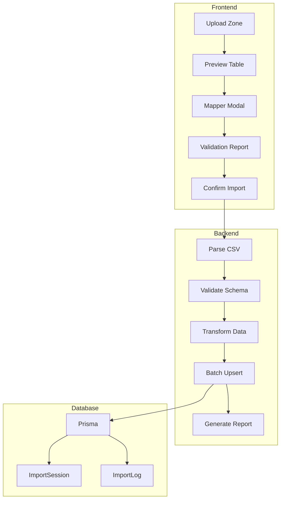

# Sistema de Gestión de Datos - Foodie Wagon

## Análisis del Esquema Actual

### Modelos Existentes

| Modelo | Campos Clave | Relaciones |
|--------|--------------|------------|
| **User** | id, email, password, name, role | - |
| **Client** | id, name, email, phone, address, province, city | → Shipment (1:N) |
| **Category** | id, name, slug, description, icon, sortOrder | → Product (1:N) |
| **Product** | id, name, slug, description, price, costPrice, image, spiceLevel, content | → Category, → ShipmentProduct |
| **Shipment** | id, hbl, clientId, address, province, city, type, status, price | → Client, → ShipmentProduct |
| **ShipmentProduct** | id, shipmentId, productId, quantity, unitPrice | → Shipment, → Product |

---

## 1. Mapeo CSV → Modelos

### A) Importación de Productos ( desde catálogo)

```csv
NOMBRE,SLUG,DESCRIPCIÓN,PRECIO,COSTE,IMAGEN,CATEGORÍA,NIVEL PICANTE,DISPONIBLE,ORDEN
Cheese Burger,cheese-burger,Delicioso burger con queso,7.00,3.50,cheese-burger.webp,Burgers,1,true,1
Blazing Nacho Beef,blazing-nacho-beef,Burger con nachos y jalapeños,13.00,6.00,blazing-nacho.webp,Burgers,3,true,2
```

### B) Importación de Categorías

```csv
NOMBRE,SLUG,DESCRIPCIÓN,ICONO,ORDEN
Burgers,burgers,Hamburguesas clásicas y especiales,burger,1
Chicken,chicken,Pollo frito y ligeras,chicken,2
Sides,sides,Guarniciones y complementos,fries,3
Drinks,drinks,Bebidas y refrescos,cup,4
```

### C) Importación de Clientes

```csv
NOMBRE,EMAIL,TELÉFONO,DIRECCIÓN,PROVINCIA,CIUDAD,NOTAS
Juan Pérez,juan@email.com,+123456789,Calle 123,Habana,La Habana,Cliente VIP
María García,maria@email.com,+987654321,Calle 456,Santiago de Cuba,-
```

### D) Importación de Envíos/Ventas

```csv
FECHA,HBL,CLIENTE_EMAIL,TIPO,ESTADO,PRECIO,DIRECCIÓN,PROVINCIA,NOTAS
01/02/2026,CM914567966AP,juan@email.com,MARITIMO,PENDING,65,Calle 123,Habana,Entregar después de 5pm
```

---

## 2. Esquema Extendido para Importación

```prisma
// Nuevos modelos para el sistema de importación

model ImportSession {
  id          String   @id @default(cuid())
  entityType  String   // "PRODUCT", "CLIENT", "SHIPMENT", "CATEGORY"
  filename    String
  totalRows   Int
  successCount Int
  errorCount  Int
  status      ImportStatus @default(PENDING)
  config      Json?    // Configuración del mapeo
  createdAt   DateTime @default(now())
  completedAt DateTime?
  
  logs        ImportLog[]
}

model ImportLog {
  id          String   @id @default(cuid())
  sessionId   String
  session     ImportSession @relation(fields: [sessionId], references: [id])
  rowNumber   Int
  status      LogStatus
  message     String?
  data        Json?
  createdAt   DateTime @default(now())
}

enum ImportStatus {
  PENDING
  PROCESSING
  COMPLETED
  FAILED
  CANCELLED
}

enum LogStatus {
  INFO
  WARNING
  ERROR
  SUCCESS
}
```

---

## 3. Arquitectura del Sistema



---

## 4. Estructura de Archivos

```
lib/
├── import/
│   ├── parser.ts          # Parseo CSV/ODS
│   ├── validator.ts       # Validación de datos
│   ├── transformer.ts     # Transformación de campos
│   ├── exporter.ts        # Exportación a CSV
│   └── utils.ts          # Utilidades compartidas

types/
├── import.ts             # Tipos del sistema
├── product.ts            # Tipos de producto
├── client.ts             # Tipos de cliente
└── shipment.ts           # Tipos de envío

app/
├── admin/import/
│   ├── page.tsx          # Panel principal de importación
│   └── components/
│       ├── upload-zone.tsx
│       ├── preview-table.tsx
│       ├── column-mapper.tsx
│       └── import-report.tsx

components/
├── admin/
│   ├── import-form.tsx   # Formulario manual genérico
│   └── entity-tables.tsx # Tablas con acciones
```

---

## 5. Componente de Formulario Manual Genérico

```typescript
// types/entity-config.ts
interface EntityConfig {
  entity: 'PRODUCT' | 'CLIENT' | 'CATEGORY' | 'SHIPMENT'
  title: string
  fields: FieldConfig[]
  apiEndpoint: string
}

const PRODUCT_CONFIG: EntityConfig = {
  entity: 'PRODUCT',
  title: 'Productos',
  apiEndpoint: '/api/products',
  fields: [
    { key: 'name', label: 'Nombre', type: 'text', required: true },
    { key: 'slug', label: 'Slug', type: 'text', required: true },
    { key: 'description', label: 'Descripción', type: 'textarea' },
    { key: 'price', label: 'Precio', type: 'number', required: true },
    { key: 'categoryId', label: 'Categoría', type: 'select', required: true },
    { key: 'image', label: 'Imagen', type: 'file' },
    { key: 'spiceLevel', label: 'Picante', type: 'range', min: 0, max: 5 },
    { key: 'available', label: 'Disponible', type: 'boolean' },
  ]
}
```

---

## 6. Flujo de Implementación

### Fase 1: Utilidades de Import/Export
- [ ] Crear `lib/import/parser.ts` (parse CSV)
- [ ] Crear `lib/import/exporter.ts` (export CSV)
- [ ] Crear `lib/import/validator.ts` (validación)

### Fase 2: API Routes
- [ ] `app/api/import/route.ts` (upload + parse)
- [ ] `app/api/export/[entity]/route.ts` (download CSV)

### Fase 3: Componentes de Importación
- [ ] `UploadZone` - Drag & drop
- [ ] `PreviewTable` - Vista previa
- [ ] `ColumnMapper` - Mapeo de columnas
- [ ] `ImportReport` - Reporte final

### Fase 4: Formularios Manuales
- [ ] `ProductForm` - CRUD productos
- [ ] `ClientForm` - CRUD clientes
- [ ] `ShipmentForm` - CRUD envíos

### Fase 5: Admin Integration
- [ ] Panel de importación unificado
- [ ] Historial de importaciones
- [ ] Estadísticas y reportes

---

## 7. Consideraciones Técnicas

### Rendimiento
- Procesamiento en chunks para archivos grandes
- Transacciones Prisma para consistencia
- Queue para imports asíncronos (opcional)

### Validación
- Zod schemas para cada entidad
- Validación bidireccional (UI + Backend)
- Mensajes de error específicos por campo

### UX
- Progreso en tiempo real
- Preview de errores antes de confirmar
- Deshacer/Reintentar operaciones
- Export con filtros y selección de columnas
