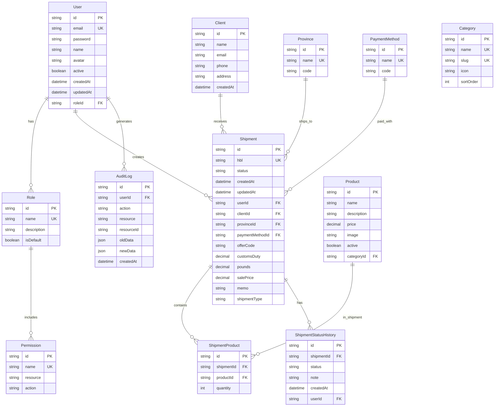

# Modelado de Base de Datos - DLA Viajes y Envíos

## 🎯 Visión General

Este proyecto ahora es una **plataforma completa de gestión** que incluye:
- **Sitio público:** Catálogo de productos/servicios (vista actual)
- **Panel de administración:** Dashboard con gestión completa del negocio

---

## 📊 Diagrama de Entidades



---

## 🗄️ Modelos de Datos (Prisma Schema)

### 1. User (Usuario)

```prisma
model User {
  id            String    @id @default(cuid())
  email         String    @unique
  password      String    // bcrypt hash
  name          String
  avatar        String?
  active        Boolean   @default(true)
  createdAt     DateTime  @default(now())
  updatedAt     DateTime  @updatedAt
  
  roleId        String
  role          Role      @relation(fields: [roleId], references: [id])
  
  shipments     Shipment[]
  auditLogs     AuditLog[]
  statusHistories ShipmentStatusHistory[]
  
  @@map("users")
}
```

### 2. Role (Rol)

```prisma
model Role {
  id          String    @id @default(cuid())
  name        String    @unique
  description String?
  isDefault   Boolean   @default(false)
  createdAt   DateTime  @default(now())
  updatedAt   DateTime  @updatedAt
  
  users       User[]
  permissions RolePermission[]
  
  @@map("roles")
}
```

### 3. Permission (Permiso)

```prisma
model Permission {
  id          String    @id @default(cuid())
  name        String    @unique  // ej: "shipments.create"
  resource    String    // ej: "shipments", "users", "products"
  action      String    // ej: "create", "read", "update", "delete"
  description String?
  createdAt   DateTime  @default(now())
  
  roles       RolePermission[]
  
  @@map("permissions")
}
```

### 4. RolePermission (Relación Roles-Permisos)

```prisma
model RolePermission {
  id           String     @id @default(cuid())
  roleId       String
  permissionId String
  createdAt    DateTime   @default(now())
  
  role         Role       @relation(fields: [roleId], references: [id], onDelete: Cascade)
  permission   Permission @relation(fields: [permissionId], references: [id], onDelete: Cascade)
  
  @@unique([roleId, permissionId])
  @@map("role_permissions")
}
```

### 5. Client (Cliente)

```prisma
model Client {
  id          String    @id @default(cuid())
  name        String
  email       String?
  phone       String?
  address     String?
  createdAt   DateTime  @default(now())
  updatedAt   DateTime  @updatedAt
  
  shipments   Shipment[]
  
  @@map("clients")
}
```

### 6. Province (Provincia de Cuba)

```prisma
model Province {
  id        String    @id @default(cuid())
  name      String    @unique  // ej: "Habana", "Santiago de Cuba"
  code      String    @unique  // ej: "CH", "SCU"
  createdAt DateTime  @default(now())
  
  shipments Shipment[]
  
  @@map("provinces")
}
```

### 7. PaymentMethod (Método de Pago)

```prisma
model PaymentMethod {
  id        String    @id @default(cuid())
  name      String    @unique  // ej: "Cash", "Zelle", "Tarjeta"
  code      String    @unique  // ej: "CASH", "ZELLE", "CARD"
  createdAt DateTime  @default(now())
  
  shipments Shipment[]
  
  @@map("payment_methods")
}
```

### 8. Category (Categoría de Productos)

```prisma
model Category {
  id        String    @id @default(cuid())
  name      String    @unique
  slug      String    @unique
  icon      String?
  sortOrder Int       @default(0)
  createdAt DateTime  @default(now())
  updatedAt DateTime  @updatedAt
  
  products  Product[]
  
  @@map("categories")
}
```

### 9. Product (Producto/Servicio)

```prisma
model Product {
  id          String    @id @default(cuid())
  name        String
  description String?
  price       Decimal   @db.Decimal(10, 2)
  image       String?
  active      Boolean   @default(true)
  createdAt   DateTime  @default(now())
  updatedAt   DateTime  @updatedAt
  
  categoryId  String
  category    Category  @relation(fields: [categoryId], references: [id])
  
  shipmentProducts ShipmentProduct[]
  
  @@map("products")
}
```

### 10. Shipment (Envío)

```prisma
model Shipment {
  id            String    @id @default(cuid())
  hbl           String    @unique  // House Bill of Lading
  status        String    @default("pending") // pending, in_transit, customs, delivered, cancelled
  offerCode     String?
  customsDuty   Decimal?  @db.Decimal(10, 2)
  pounds        Decimal?  @db.Decimal(10, 2)
  salePrice     Decimal?  @db.Decimal(10, 2)
  memo          String?
  shipmentType  String    // MARITIMO, AEREO
  createdAt     DateTime  @default(now())
  updatedAt     DateTime  @updatedAt
  
  // Relaciones
  userId        String
  user          User      @relation(fields: [userId], references: [id])
  
  clientId      String?
  client        Client?   @relation(fields: [clientId], references: [id])
  
  provinceId    String?
  province      Province? @relation(fields: [provinceId], references: [id])
  
  paymentMethodId String?
  paymentMethod   PaymentMethod? @relation(fields: [paymentMethodId], references: [id])
  
  // Relaciones Hijas
  products      ShipmentProduct[]
  statusHistories ShipmentStatusHistory[]
  
  @@map("shipments")
}
```

### 11. ShipmentProduct (Productos en Envío)

```prisma
model ShipmentProduct {
  id         String    @id @default(cuid())
  quantity   Int       @default(1)
  createdAt  DateTime  @default(now())
  
  shipmentId String
  shipment   Shipment  @relation(fields: [shipmentId], references: [id], onDelete: Cascade)
  
  productId  String
  product    Product   @relation(fields: [productId], references: [id])
  
  @@unique([shipmentId, productId])
  @@map("shipment_products")
}
```

### 12. ShipmentStatusHistory (Historial de Estados)

```prisma
model ShipmentStatusHistory {
  id         String    @id @default(cuid())
  status     String
  note       String?
  createdAt  DateTime  @default(now())
  
  shipmentId String
  shipment   Shipment  @relation(fields: [shipmentId], references: [id], onDelete: Cascade)
  
  userId     String?
  user       User?     @relation(fields: [userId], references: [id])
  
  @@map("shipment_status_histories")
}
```

### 13. AuditLog (Logs de Auditoría)

```prisma
model AuditLog {
  id          String    @id @default(cuid())
  action      String    // CREATE, UPDATE, DELETE
  resource    String    // shipment, user, product
  resourceId  String?
  oldData     Json?
  newData     Json?
  createdAt   DateTime  @default(now())
  
  userId      String?
  user        User?     @relation(fields: [userId], references: [id])
  
  @@index([resource, resourceId])
  @@map("audit_logs")
}
```

---

## 🔐 Sistema de Permisos

### Roles Predeterminados

| Rol | Descripción | Permisos |
|-----|-------------|----------|
| **Admin** | Administrador completo | Todos los permisos |
| **Manager** | Gestor de envíos | CRUD envíos, productos, clientes |
| **Operator** | Operador | CREATE/UPDATE envíos, READ productos |
| **Viewer** | Solo lectura | READ solo |

### Permisos por Recurso

| Recurso | Acciones |
|---------|----------|
| users | create, read, update, delete |
| roles | create, read, update, delete |
| shipments | create, read, update, delete |
| products | create, read, update, delete |
| categories | create, read, update, delete |
| clients | create, read, update, delete |
| reports | read, export |

---

## 📱 Panel de Administración

### Estructura de Rutas

```
app/
├── (public)/                    # Sitio público
│   ├── page.tsx                 # Homepage
│   ├── product/[id]/            # Detalle producto
│   └── ...
│
└── (admin)/                     # Panel de administración
    ├── layout.tsx               # Layout con sidebar
    ├── page.tsx                 # Dashboard
    │
    ├── dashboard/               # Analytics
    │   └── page.tsx
    │
    ├── shipments/               # Gestión de envíos
    │   ├── page.tsx             # Lista
    │   ├── [id]/                # Detalle
    │   │   ├── page.tsx
    │   │   └── edit/
    │   │       └── page.tsx
    │   └── new/
    │       └── page.tsx
    │
    ├── products/                # Gestión de productos
    │   ├── page.tsx
    │   ├── [id]/
    │   │   ├── page.tsx
    │   │   └── edit/
    │   └── new/
    │
    ├── categories/              # Gestión de categorías
    │
    ├── clients/                 # Gestión de clientes
    │
    ├── users/                   # Gestión de usuarios
    │   ├── page.tsx
    │   ├── [id]/
    │   └── new/
    │
    └── settings/                # Configuración
```

### Dashboard - Métricas Clave

```typescript
interface DashboardStats {
  totalShipments: number
  pendingShipments: number
  inTransitShipments: number
  deliveredShipments: number
  totalRevenue: number
  shipmentsByType: { MARITIMO: number; AEREO: number }
  shipmentsByProvince: { province: string; count: number }[]
  recentActivity: AuditLog[]
}
```

---

## 🚀 Plan de Implementación

### Fase 1: Base de Datos
- [ ] Crear modelos en Prisma
- [ ] Crear migraciones
- [ ] Seed de datos iniciales (roles, provincias, métodos de pago)

### Fase 2: Autenticación
- [ ] Setup NextAuth.js o similar
- [ ] Crear middleware de protección de rutas
- [ ] Implementar login/logout
- [ ] Verificación de permisos por ruta

### Fase 3: API Routes CRUD
- [ ] Users CRUD
- [ ] Shipments CRUD
- [ ] Products CRUD
- [ ] Clients CRUD

### Fase 4: Panel de Administración
- [ ] Layout con sidebar
- [ ] Dashboard con métricas
- [ ] Vistas de lista y formulario
- [ ] Filtros y búsqueda
- [ ] Exportación de datos

### Fase 5: Mejoras
- [ ] Audit logs automáticos
- [ ] Notificaciones
- [ ] Reportes PDF/Excel
