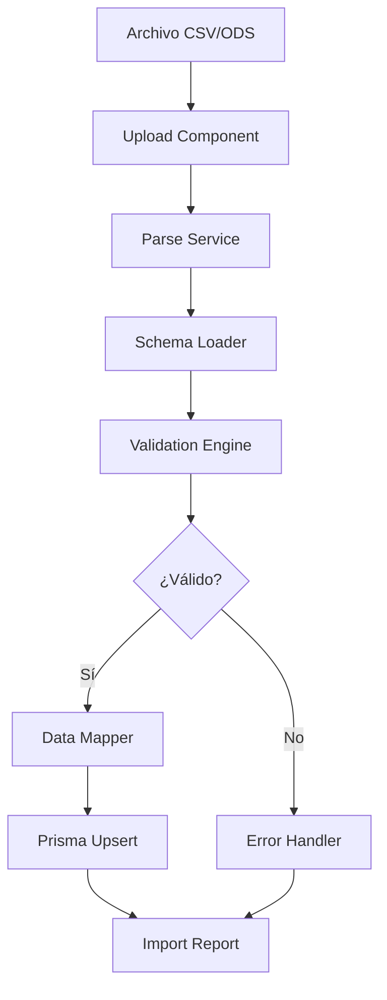

# Sistema de Importación de Datos - Plan de Arquitectura

## 1. Análisis del Archivo CSV

### Estructura Detectada (VENTAS-FEBRERO-DLA.csv)

| # | Columna | Tipo | Descripción |
|---|---------|------|-------------|
| 1 | FECHA | Date | Fecha del envío (DD/MM/YY) |
| 2 | TIPO ENVÍO | Enum | MARÍTIMO / AÉREO |
| 3 | TIPO MERCANCÍA | Enum | MISCELÁNEA / DURADERO |
| 4 | HBL | String | Número de跟踪 (CM914567966AP) |
| 5 | CÓDIGO OFERTA | String | Código promocional |
| 6 | IMPUESTO ADUANA | Decimal | Tax aduanal |
| 7 | LIBRAS | Decimal | Peso en libras |
| 8 | PRECIO VENTA | Decimal | Precio de venta |
| 9 | LIBRAS gratis | Decimal | Peso gratis |
| 10 | IMPORTE DESCONTADO | Decimal | Descuento aplicado |
| 11 | COBRADO | Decimal | Total cobrado |
| 12 | DESTINO | Enum | Provincia de Cuba |
| 13 | MÉTODO PAGO | Enum | CASH / ZELLE / TARJETAS |
| 14 | MEMO | String | Notas adicionales |
| 15 | NOMBRE PAGA | String | Nombre del pagador |

## 2. Esquema de Configuración

```json
// config/import-schemas/ventas-febrero.json
{
  "name": "VENTAS-FEBRERO-DLA",
  "version": "1.0",
  "delimiter": ";",
  "skipRows": 2,
  "columns": [
    {
      "source": "FECHA",
      "target": "shipmentDate",
      "type": "date",
      "format": "dd/MM/yy",
      "required": true,
      "transform": "parseDate"
    },
    {
      "source": "TIPO ENVÍO",
      "target": "shippingType",
      "type": "enum",
      "values": ["MARÍTIMO", "AÉREO"],
      "default": "MARÍTIMO"
    },
    {
      "source": "TIPO MERCANCÍA",
      "target": "productType",
      "type": "enum",
      "values": ["MISCELÁNEA", "DURADERO"],
      "default": "MISCELÁNEA"
    },
    {
      "source": "HBL",
      "target": "trackingNumber",
      "type": "string",
      "required": true,
      "unique": true
    },
    {
      "source": "CÓDIGO OFERTA",
      "target": "offerCode",
      "type": "string",
      "optional": true
    },
    {
      "source": "IMPUESTO ADUANA",
      "target": "customsTax",
      "type": "decimal",
      "default": 0
    },
    {
      "source": "LIBRAS",
      "target": "weight",
      "type": "decimal",
      "required": true
    },
    {
      "source": "PRECIO VENTA",
      "target": "salePrice",
      "type": "decimal",
      "default": 0
    },
    {
      "source": "LIBRAS gratis",
      "target": "freeWeight",
      "type": "decimal",
      "default": 0
    },
    {
      "source": "IMPORTE DESCONTADO",
      "target": "discountAmount",
      "type": "decimal",
      "default": 0
    },
    {
      "source": "COBRADO",
      "target": "collectedAmount",
      "type": "decimal",
      "required": true
    },
    {
      "source": "DESTINO",
      "target": "destinationProvince",
      "type": "string",
      "required": true
    },
    {
      "source": "MÉTODO PAGO",
      "target": "paymentMethod",
      "type": "enum",
      "values": ["CASH", "ZELLE", "TARJETAS"],
      "transform": "normalizePaymentMethod"
    },
    {
      "source": "MEMO",
      "target": "notes",
      "type": "string",
      "optional": true
    },
    {
      "source": "NOMBRE PAGA",
      "target": "payerName",
      "type": "string",
      "required": true
    }
  ],
  "validation": {
    "rules": [
      {
        "field": "weight",
        "condition": "weight > 0",
        "message": "El peso debe ser mayor a 0"
      },
      {
        "field": "trackingNumber",
        "condition": "startsWith(trackingNumber, 'CM')",
        "message": "El HBL debe comenzar con 'CM'"
      }
    ]
  }
}
```

## 3. Extensión del Esquema Prisma

```prisma
// prisma/schema.prisma - Agregar al final

model ImportBatch {
  id          String   @id @default(cuid())
  filename    String
  schemaName  String
  totalRows   Int
  successRows Int
  errorRows   Int
  status      ImportStatus @default(PENDING)
  createdAt   DateTime @default(now())
  updatedAt   DateTime @updatedAt
  
  records     ImportRecord[]
}

model ImportRecord {
  id          String   @id @default(cuid())
  batchId     String
  batch       ImportBatch @relation(fields: [batchId], references: [id])
  
  rowNumber   Int
  status      RecordStatus @default(PENDING)
  rawData     Json
  parsedData  Json?
  errors      Json?
  
  createdAt   DateTime @default(now())
  
  batch       ImportBatch @relation(fields: [batchId], references: [id])
}

enum ImportStatus {
  PENDING
  PROCESSING
  COMPLETED
  FAILED
}

enum RecordStatus {
  PENDING
  VALIDATED
  IMPORTED
  FAILED
}
```

## 4. Arquitectura del Sistema



## 5. Componentes a Implementar

### Backend
- `lib/import/parser.ts` - Parser CSV/ODS
- `lib/import/schema.ts` - Schema loader
- `lib/import/validator.ts` - Validation engine
- `lib/import/mapper.ts` - Field mapper
- `app/api/import/route.ts` - Upload API
- `app/api/import/[id]/route.ts` - Status API

### Frontend
- `components/import/upload-zone.tsx` - Drag & drop
- `components/import/schema-selector.tsx` - Selector de esquema
- `components/import/column-mapper.tsx` - Mapeo manual
- `components/import/validation-preview.tsx` - Preview de validación
- `components/import/import-progress.tsx` - Progreso
- `components/import/import-report.tsx` - Reporte final

## 6. Flujo de Implementación

### Fase 1: Parser y Schema
1. Crear `lib/import/config/` para schemas JSON
2. Implementar parser CSV con soporte para delimitadores
3. Crear utilería de validación

### Fase 2: Backend API
1. Endpoint upload multipart
2. Procesamiento asíncrono (queue)
3. Validación y mapeo de campos
4. Upsert a Prisma

### Fase 3: Frontend
1. Upload zone con drag & drop
2. Preview de datos
3. Mapeo de columnas configurables
4. Reporte de importación

### Fase 4: Mejoras
1. Templates de importación
2. Historial de importaciones
3. Rollback de importaciones
4. Export a CSV
